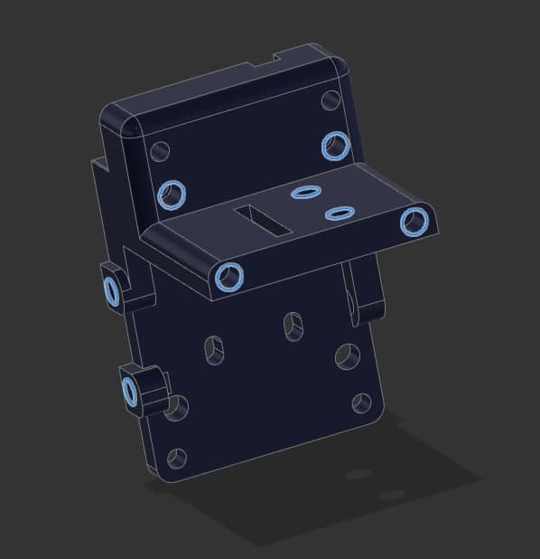
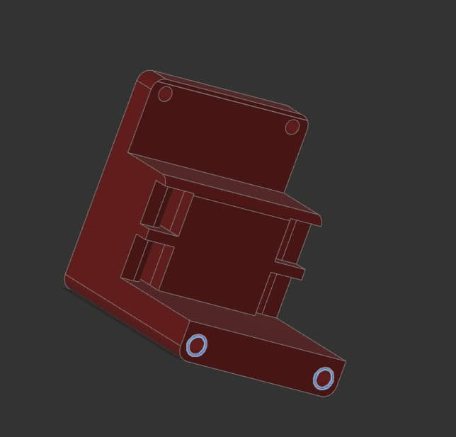
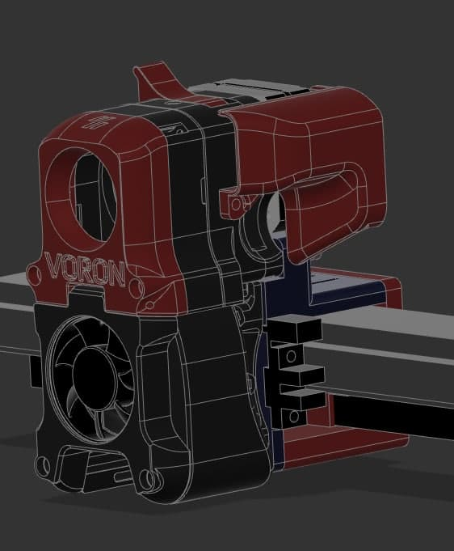
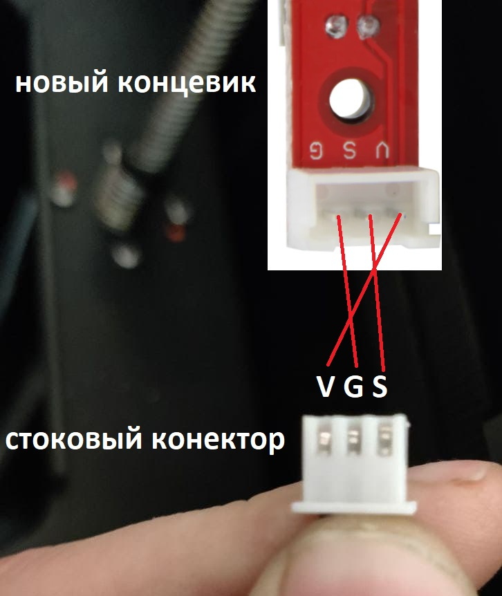

# Flyingbear Reborn 10mm belt +voron afterburner update

### INTRO

Делюсь своим видиньем перевода 3D принтера FlyingBear Reborn на 10мм ремни и перехода на печатающую голову afterburner от [VORONDESIGN](https://www.vorondesign.com/).

### CONS/PROS

\+ Возможность использовать различные варианты хотенда (V6, Dragon, Dragonfly, Moskito )

\+ Возможность использованиея разрезного ремня (open belt) который дешевле

\+ Двусторонний обдув 4020 турбиной

\+ Обдув радиатора 4010 вентилятором что снижает шум

\+ Возможность установки BlTouch/3DTouch

\+ Более плавная печать за счет 10мм ремней

\+ Легкий и удобный экструдер

\- Небольшое снижение печатающей области

### BOM

##### Для печатной головы Voron Afterburner

M3\*8mm SHCS - 2шт

M3\*12mm SHCS - 2шт

M3\*16mm SHCS - 4шт

M3\*20mm SHCS - 5шт

M3\*30mm SHCS - 6шт

M3\*40mm SHCS - 2шт

[Insert M3D5L4](https://aliexpress.ru/item/4000232858343.html) -12шт

(Все метизы для головы можно [купить набором к примеру тут](https://aliexpress.ru/item/1005003096841891.html) )

[4010 fan](https://aliexpress.ru/item/32727867521.html)

[4020 turbine](https://aliexpress.ru/item/32814937229.html)

[DDB kit](https://aliexpress.ru/item/4000021186440.html)

[v6 не volcano](https://aliexpress.ru/item/32844028127.html)/dragon/moskito honend в сборе в зависимости от выбора

4mm PTFE трубка

[NEMA17 20mm stepper motor](https://aliexpress.ru/item/1005002435137651.html) (ASH для высоких температур до 180С)

[( опционально ) плата разъемов](https://aliexpress.ru/item/1005003559795724.html)

##### Для адаптера под FB Reborn

M3\*8mm SHCS - 8шт

M3\*25mm SHCS - 2шт

M3\*10mm SHCS - 2шт

[Insert M3D5L4](https://aliexpress.ru/item/4000232858343.html) -14шт

[Оптический концевик](https://aliexpress.ru/item/32909701232.html) (требуется инверсия относительно стоковых )

(опционально) [ADXL345 aсelerometr](https://aliexpress.ru/item/32949372779.html) для клиппера

(опционально) 3DTouch/BLTouch

(В комплекте крепежа для VORON AB хватает болтов и для адаптера в общем итоге будет необходимо купить комплект и вплавляемые резьбовые втулки)

##### Для перехода на 10мм ремни

[2GT 20 Teeth Synchronou Idler Pulley Bore 5mm](https://www.aliexpress.com/item/32750484488.html) no teeth for belt 10mm - 2шт

[2GT 20 Teeth Synchronou Idler Pulley Bore 5mm](https://www.aliexpress.com/item/32750484488.html) with teeth for belt 10mm - 6шт

[20 teeth GT 2GT 2M Timing Pulley Bore 5mm for belt 10mm](https://www.aliexpress.com/item/32995102911.html) -2шт

[Ремень 2GT open belt 10mm](https://aliexpress.ru/item/902692789.html) \~ 4м ( около 5м если выносить моторы из корпуса )

[Дистанционные шайбы 5х7х0.2 мм](https://aliexpress.ru/item/1005001878385012.html) - пару пакетов по 50шт.

[Болты с плечем m4d5l30 mm](https://aliexpress.ru/item/1005003325718939.html) - 8шт

### MANUAL

#### Печать деталей

##### 1 Voron Afterburner

Скачиваем из официального репозитория <https://github.com/VoronDesign/Voron-Afterburner> STL файлы под необходимую конфигурацию .

(в папке CAD можно найти сборочный чертеж в формате f3d (для Fusion360) и step)

Пояснение:

* В корне папки STLs печатаем все три детали
* В папке Printheads выбираем необходимый хотэнд и печатаем под него обе детали ("printhead_front\*_*имяхотэнда*" и "\*printhead_rear_имяхотэнда" )
* В папке Bowden лежит комплект запчастей под Bowden экструдер если он вам нужен
* В папке Direct_Feed лежит комплект под директ экструдер (Clockwork) на основе экструдера дуал драйв или клона. Из этой папки печатаем [[a]_connector_cover](https://github.com/VoronDesign/Voron-Afterburner/blob/master/STLs/Direct_Feed/%5Ba%5D_connector_cover.stl), [[a]_guidler](https://github.com/VoronDesign/Voron-Afterburner/blob/master/STLs/Direct_Feed/%5Ba%5D_guidler.stl), [[a]_latch](https://github.com/VoronDesign/Voron-Afterburner/blob/master/STLs/Direct_Feed/%5Ba%5D_latch.stl), [[a]_latch_shuttle](https://github.com/VoronDesign/Voron-Afterburner/blob/master/STLs/Direct_Feed/%5Ba%5D_latch_shuttle.stl), [extruder_body](https://github.com/VoronDesign/Voron-Afterburner/blob/master/STLs/Direct_Feed/extruder_body.stl).
* Детали chain_anchor... и [extruder_motor_plate](https://github.com/VoronDesign/Voron-Afterburner/blob/master/STLs/Direct_Feed/extruder_motor_plate.stl) лучше взять из моего архива.
* Все детали с [a] в начале названия можно печатать другим цветом.

##### 2 Печать переходника и усилителей.

В папке STLs 3 папки: Belt idlers supports, VAB adapter, VAB mixed parts

\- Belt idlers supports- тут лежат усилители для роликов балки. Усилители крепятся на 3 болта каждый, и для крепления необходимо дополнительное отверстие для точного сверления которого пригодятся y-max(min) drill conductor которые нужно вставить в отверстия вместо стоковых болтов и просверлить отверстие D3.3mm и нарезать резьбу M4 (можно и просто отверстие пошире чтобы проходила резьба и зажать гайкой ). Один ролик (без зубов на Y-min ) с широким фланцем необходимо обточить чтобы уменьшить один фланец до \~ D15mm (иначе не встанет в балку). Для этого необходимо распечатать 2 детали idler cut support и стянуть этими через эти детали ролик болтом c гайкой м3 вставить эту конструкцию в дрел/шуруповерт и сточить один фланец об напильник/точильный камень (не забудьте пройтись мелкой наждачкой по срезу чтобы убрать всё за что может цепляться ремень).

\- VAB adapter - тут расположен сам адаптер для крепления головы Voron Afterburner . Front и Rear распечатать , при использовании 3D/BLtouch распечатать BLT , вплавить втулки в места подсвеченные на картинках ниже.

\- VAB mixed parts - тут части от головы Voron Afterburner измененные или дополнительные. Если в будущем планируете ставить переходную плату головы вам понадобится MIX pcb spacer и MIX extrudermotorplate for pcb. Так же там лежит MIX zipties *x*chain_anchor для крепления стяжками жгута головы.

##### 3 Порядок сборки

После печати необходимых деталей нужно вплавить резьбовые втулки. На рисунках ниже подсвечены места вплавления втулок именно с той стороны с которой их нужно вплавлять. Места вплавления втулок и сборку самой головы Voron Afterburner можно посмотреть либо в чертеже либо в [официальном мануале по сборке voron 2.4](https://github.com/VoronDesign/Voron-2/blob/Voron2.4/Docs/2.4_Assembly_Manual.pdf) начиная со страницы 66



При установке концевика необходимо выпаять разъем и припаять провода напрямую. Также необходимо инвертировать сигнал относительно стоковых .

```
#define Y_MIN_ENDSTOP_INVERTING false
```

Акселерометр крепится сверху над балкой .

При сборке усилителей для роликов , используйте дистанционные шайбы и проверяйте вращение роликов чтобы не перетянуть их.

P.S.

Мне для сборки головы хватило набора крепежа из комплекта и дополнительно пакетика резьбовых втулок. В интернете есть огромное количество модов для этой головы. А еще можно сделать что то самому из исходников.
